.. _scrolling_tutorial:

.. highlight:: ca65

Atari 8-bit Fine Scrolling: A Complete(ish) Tutorial
======================================================================

**Revision 4, updated 17 Dec 2019**

This is a tutorial on fine scrolling for the Atari 8-bit series of computers.
In a nutshell, the ANTIC coprocessor provides 2D hardware scrolling at very
little computational expense.

Scrolling means the display screen is a window or *viewport* on a larger map.
At any moment in time, the user is looking at only a small portion of the
overall area, and this viewport can be moved around. The Atari hardware
provides for both coarse scrolling (that is, moving the viewport at byte or
character boundaries) and fine scrolling (moving with higher resolution: scan
lines vertically and color clocks horizontally). Fine scrolling on the Atari is
built upon coarse scrolling, so we will first examine the latter before make
the scrolling smooth by tackling the former.

No prior knowledge of scrolling is necessary before reading this tutorial.
However, this is advanced programming tutorial in the sense that the examples
are written in assembly language, so the assumption will be that you are
comfortable with that. All the examples here are assembled using the
MAC/65-compatible assembler `ATasm
<https://atari.miribilist.com/atasm/index.html>`_ (and more specifically to
this tutorial, the version built-in to `Omnivore
<https://github.com/robmcmullen/omnivore>`_).

.. note:: All source code and XEX files are available in the `scrolling_tutorial source code repository <https://github.com/playermissile/scrolling_tutorial>`_ on github.

.. seealso::

   Here are some resources for learning more about scrolling:

   * `Atari Graphics & Arcade Game Design, Chapter 7 <https://archive.org/details/ataribooks-atari-graphics-and-arcade-game-design/page/n221>`_

A Refresher on Display Lists
--------------------------------------------

Display lists are an important topic for scrolling, because certain flags on
display list commands tell ANTIC which lines get scrolled and which are left
alone. For a summary, check out my :ref:`tutorial on DLIs <dli_tutorial>` which
has a large section on display list instructions. A small amount of relevant
detail is repeated here.

An ANTIC display list instruction consists of 1 byte with an optional 2 byte
address. There are 3 types of instructions: blank lines, graphics modes, and
jump instructions. Instructions are encoded into the byte using a bitmask
where low 4 bits encode the graphics mode or feature and the high 4 bits
encode the flags that affect that instruction:

  +-----+-----+---------+---------+-----+-----+-----+-----+
  |  7  |  6  |  5      |    4    |  3  |  2  |  1  |  0  |
  +-----+-----+---------+---------+-----+-----+-----+-----+
  | DLI | LMS | VSCROLL | HSCROLL |  Mode                 |
  +-----+-----+---------+---------+-----+-----+-----+-----+

The 4 flags are:

 * DLI (``$80``): enable a display list interrupt when processing this instruction
 * LMS (``$40``): trigger a Load Memory Scan, changing where ANTIC looks for screen data, and requires an additional 2 byte address immediately following this instruction byte.
 * VSCROLL (``$20``): enable vertical scrolling for this mode line
 * HSCROLL (``$10``): enable horizontal scrolling for this mode line

There are 14 available graphics modes, which are encoded into low 4 bits. This
tutorial is only going to focus on three of the text modes. Any mode can be
scrolled horizontally, and modes taller than 1 scan line can also be scrolled
vertically, but the combination of low memory usage and large height of the
text modes make them ideal candidates for scrolling games.

.. csv-table::

    Mode, Decimal, BASIC Mode,  Description, Scan Lines, Type, Colors
    2, 02,    0,     40 x 24,   8, text, 2
    4, 04,    n/a,   40 x 24,   8, text, 5
    5, 05,    n/a,   40 x 12,  16, text, 5

.. seealso::

   More resources about display lists are available:

   * The :ref:`Display Lists section <display_lists>` of my DLI tutorial
   * The `SDLSTL memory location <https://www.atariarchives.org/mapping/memorymap.php#560,561>`_ in Mapping the Atari
   * `Appendix 8 <https://www.atariarchives.org/mapping/appendix8.php>`_ of Mapping the Atari
   * `De Re Atari, Chapter 2 <https://www.atariarchives.org/dere/chapt02.php>`_

Coarse Scrolling
---------------------------------------

Coarse scrolling, that is: scrolling at character or byte boundaries (in what
appears on screen as blocky jumps), can be accomplished without any use of the
hardware scrolling registers. In fact, coarse scrolling falls out as a side-
effect of the ``LMS`` bit on display list commands. Being able to reposition
the memory pointer for any display list instruction means that you can tell
ANTIC where to look in memory when it draws a scan line. Simply by moving the
address pointer to a different location, you can change the display.

First we will look at vertical coarse scrolling which is the simpler case than
horizontal coarse scrolling. After examining horizontal coarse scrolling, we
will combine the two which will give us unrestricted 2D scrolling.

Definitions
~~~~~~~~~~~~~~~~~~~~~~~~~~

It helps to set up what we mean by the directions, because depending on your
perspective, **scrolling up** and **scrolling down** (and similarly **left**
and **right**) could mean exactly opposite things. Are the directions referring
to which way the data is moving on the screen? Or which way the viewport is
moving over the larger screen memory layout?

The convention is to refer to the direction as the way the viewport is moving.
So, **scrolling up** means the viewport is moving up over the screen memory
layout, but what that means in terms of what's displayed is that new data is
appearing at the top of the screen, pushing everything else down the screen and
old data is vanishing off the bottom of the screen.

Because there are so many types of lines, the word line becomes ambiguous without clarification. There are:

 * scan lines on screen
 * number of scan lines in a character cell
 * lines of characters in the viewport
 * lines of characters in the screen memory layout

Vertical Coarse Scrolling
------------------------------------------

Coarse scrolling vertically is moving the playfield data such that the user
sees a new line of information on the top of the screen while the line that was
previously on the on the bottom of the screen moves off, and all other visible
lines move down one line. (Or vice-versa: new data appears on the bottom while
a line is removed from the top.) This direction is simpler than horizontal
because only a single ``LMS`` instruction needs to be updated, so that is where
we will start.

Memory Layout
~~~~~~~~~~~~~~~~~~~~

To move a viewport window up or down over a larger map doesn't require any
difference in memory layout for the screen data, just more of it.

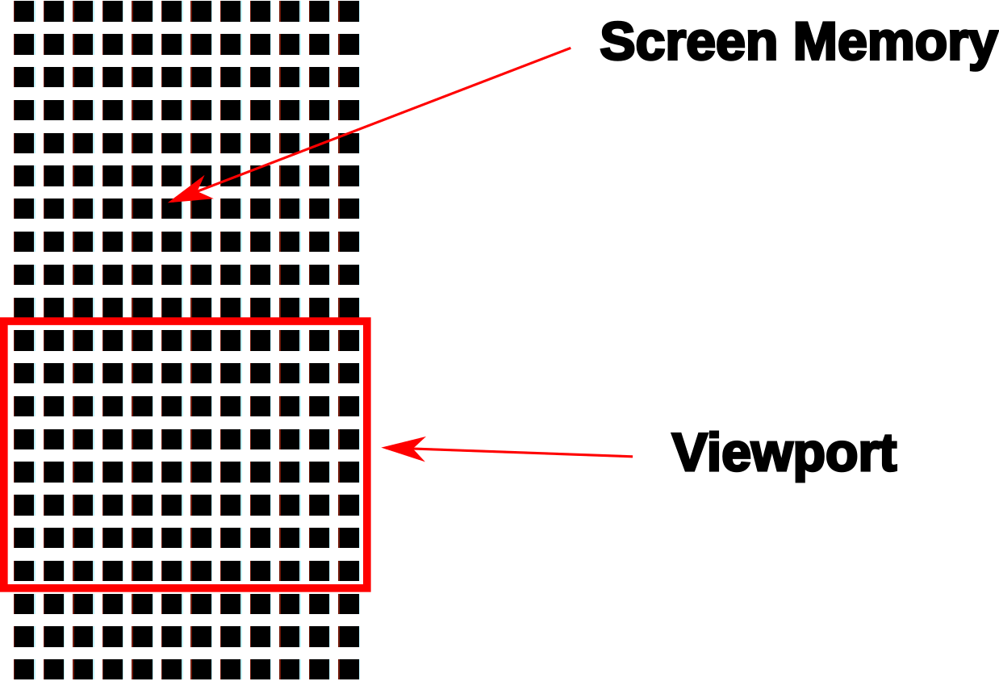

.. _coarse_no_scroll_dlist:

Preparing the Display List
~~~~~~~~~~~~~~~~~~~~~~~~~~~~~~~~~~~~~~

Here is a display list without any scrolling, and just a single instruction
with ``LMS`` set in the main region of mode 4 lines. That ``LMS`` tells ANTIC
where to look in memory for that first line and all subsequent lines until another ``LMS`` instruction is encountered.

.. raw:: html

   <ul>
   <li><b>Source Code:</b> <a href="https://raw.githubusercontent.com/playermissile/scrolling_tutorial/master/src/coarse_no_scroll_dlist.s">coarse_no_scroll_dlist.s</a></li>
   <li><b>Executable:</b> <a href="https://raw.githubusercontent.com/playermissile/scrolling_tutorial/master/xex/coarse_no_scroll_dlist.xex">coarse_no_scroll_dlist.xex</a></li>
   </ul>

All this test program does is create a display list and show a simple test
pattern. There is nothing special about this display list, no scrolling bits
set on any display list instructions; only the ``LMS`` instruction to set the
initial memory location for the 22 lines of ANTIC Mode 4 that will become the
scrolling region in further examples, and another ``LMS`` for the two lines of
ANTIC mode 2 at the bottom for non-scrolling status lines.

.. code-block::

   ; Simple display list to be used as coarse scrolling comparison
   dlist_coarse_mode4
           .byte $70,$70,$70       ; 24 blank lines
           .byte $44,$00,$80       ; Mode 4 + LMS + address
           .byte 4,4,4,4,4,4,4,4   ; 21 more Mode 4 lines
           .byte 4,4,4,4,4,4,4,4
           .byte 4,4,4,4,4
           .byte $42,<static_text, >static_text ; 2 Mode 2 lines + LMS + address
           .byte $2
           .byte $41,<dlist_coarse_mode4,>dlist_coarse_mode4 ; JVB ends display list

.. _coarse_scroll_down:

Example: Coarse Scrolling Down
----------------------------------

Scrolling down means new data is appearing at the bottom of the screen, pushing
data currently on the screen upwards and finally disappearing off the top of
the screen:

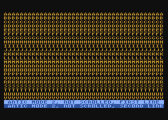

.. raw:: html

   <ul>
   <li><b>Source Code:</b> <a href="https://raw.githubusercontent.com/playermissile/scrolling_tutorial/master/src/coarse_scroll_down.s">coarse_scroll_down.s</a></li>
   <li><b>Executable:</b> <a href="https://raw.githubusercontent.com/playermissile/scrolling_tutorial/master/xex/coarse_scroll_down.xex">coarse_scroll_down.xex</a></li>
   </ul>

This is accomplished by updating the start address that ANTIC sees for the
first line. 

.. code-block::

   ; move viewport one line down by pointing display list start address
   ; to the address 40 bytes further in memory
   coarse_scroll_down
           clc
           lda dlist_coarse_address
           adc #40
           sta dlist_coarse_address
           lda dlist_coarse_address+1
           adc #0
           sta dlist_coarse_address+1
           rts

Adding 40 bytes to that address will move the starting point one
line higher in memory, moving what was the 2nd line being displayed to the
first line and a line previously off-screen to the 22nd line. This gives the
appearance of the playfield window moving down across the map.

The code needs a timing loop so the scrolling doesn't happen too fast:

.. code-block::

   loop
           ldx #15         ; number of VBLANKs to wait
   ?start  lda RTCLOK+2    ; check fastest moving RTCLOCK byte
   ?wait   cmp RTCLOK+2    ; VBLANK will update this
           beq ?wait       ; delay until VBLANK changes it
           dex             ; delay for a number of VBLANKs
           bpl ?start
   
           ; enough time has passed, scroll one line
           jsr coarse_scroll_down
   
           jmp loop

This delay loop simply waits for a number of vertical blank intervals to pass,
then updates the screen memory pointer.

Example: Coarse Scrolling Up
----------------------------------

Scrolling up means new data is appearing at the top of the screen, pushing data
currently on the screen downwards and finally disappearing off the bottom of
the screen:

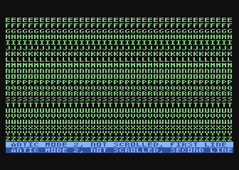

.. raw:: html

   <ul>
   <li><b>Source Code:</b> <a href="https://raw.githubusercontent.com/playermissile/scrolling_tutorial/master/src/coarse_scroll_up.s">coarse_scroll_up.s</a></li>
   <li><b>Executable:</b> <a href="https://raw.githubusercontent.com/playermissile/scrolling_tutorial/master/xex/coarse_scroll_up.xex">coarse_scroll_up.xex</a></li>
   </ul>

This is accomplished using exactly the same method of changing the start
address that ANTIC uses for the screen memory:

.. code-block::

   ; move viewport one line up by pointing display list start address
   ; to the address 40 bytes earlier in memory
   coarse_scroll_up
           sec
           lda dlist_coarse_address
           sbc #40
           sta dlist_coarse_address
           lda dlist_coarse_address+1
           sbc #0
           sta dlist_coarse_address+1
           rts

But instead of adding 40 bytes, we subtract 40 bytes from the address to move
the starting point one line prior in memory, moving what was the 1st line being
displayed to the 2nd line and a line previously off-screen to the 1st line.
This gives the appearance of the playfield window moving up across the map.

Horizontal Coarse Scrolling
------------------------------------------

Horizontal coarse scrolling is only slightly more complicated than vertical
coarse scrolling because multiple ``LMS`` addresses need to be updated.

Memory Layout
~~~~~~~~~~~~~~~~~~~~

Scrolling left and right does present a different problem, because if only the
first ``LMS`` address is updated, a subsequent line will use memory immediately
following the previous line, resulting in a snake-like movement that doesn't
resemble scrolling.

To remedy this, the memory should be thought of as individual horizontal
strips, which for ANTIC to process correctly requires ``LMS`` addresses on
every display list line in the scrolling region.

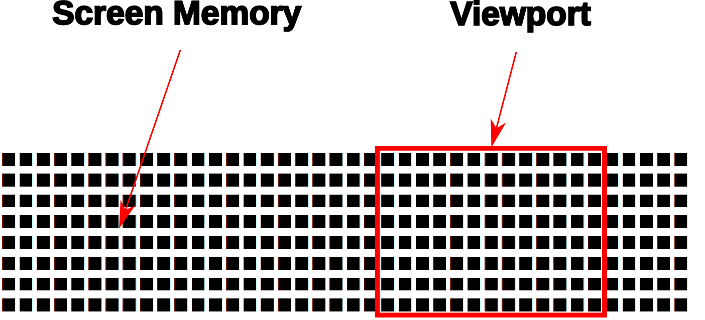

For this tutorial, the horizontal memory layout is going to use an entire page
of memory (256 bytes, so 256 characters) per line of screen memory. At the cost
of some RAM, this will simplify our ``LMS`` modifications in that only the low
byte will need to be modified in the case of pure horizontal scrolling, and
only the high byte needs to change in the case of pure vertical scrolling.

This is a tradeoff that is good for speed and reduced code complexity, but if
your memory constraints outweigh your speed requirements, this may not be a
tradeoff you are willing to make. The byte width of your screen memory layout
is entirely arbitrary; the ``LMS`` calculations will just be more complicated
(and therefore slower) with widths where you must do arithmetic to calculate
the addresses.

.. _coarse_scroll_left:

Example: Coarse Scrolling Left
-----------------------------------

Scrolling left means new data is appearing on the left of the screen, pushing
data currently on the screen to the right and finally disappearing off the
right side of the screen. Every 16 bytes, the memory layout has been stamped
with the hex addresses of the screen memory so you can tell where the viewport
has scrolled to.

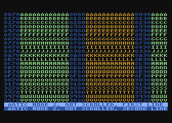

.. raw:: html

   <ul>
   <li><b>Source Code:</b> <a href="https://raw.githubusercontent.com/playermissile/scrolling_tutorial/master/src/coarse_scroll_left.s">coarse_scroll_left.s</a></li>
   <li><b>Executable:</b> <a href="https://raw.githubusercontent.com/playermissile/scrolling_tutorial/master/xex/coarse_scroll_left.xex">coarse_scroll_left.xex</a></li>
   </ul>

Because each ``LMS`` address in the scrolling region and the one-line buffer
zone must be updated, a loop is used here. Moving to the left means moving
lower in memory, in this case: one byte at a time:

.. code-block::

   ; move viewport one byte to the left by pointing each display list start
   ; address to one byte lower in memory
   coarse_scroll_left
           ldy #22         ; 22 lines to modify
           ldx #4          ; 4th byte after start of display list is low byte of address
   ?loop   dec dlist_lms_mode4,x
           inx             ; skip to next low byte which is 3 bytes away
           inx
           inx
           dey
           bne ?loop
           rts

There's no bounds checking in this example, so if you let it run long enough it
will display  low byte address moves from ``$00`` to
``$ff``. "Defender"-style wrapping, to make it appear like there is no start or
end, takes some special preparations and will be discussed below.

Here's the display list:

.. code-block::

   ; one page per line, used for coarse scrolling. Start visible region
   ; in middle of each page so it can scroll either right or left immediately
   ; without having to check for a border
   dlist_lms_mode4
           .byte $70,$70,$70
           .byte $44,$70,$80       ; first line of scrolling region
           .byte $44,$70,$81
           .byte $44,$70,$82
           .byte $44,$70,$83
           .byte $44,$70,$84
           .byte $44,$70,$85
           .byte $44,$70,$86
           .byte $44,$70,$87
           .byte $44,$70,$88
           .byte $44,$70,$89
           .byte $44,$70,$8a
           .byte $44,$70,$8b
           .byte $44,$70,$8c
           .byte $44,$70,$8d
           .byte $44,$70,$8e
           .byte $44,$70,$8f
           .byte $44,$70,$90
           .byte $44,$70,$91
           .byte $44,$70,$92
           .byte $44,$70,$93
           .byte $44,$70,$94
           .byte $44,$70,$95       ; last line with scroll bit set
           .byte $42,<hscroll_static_text, >hscroll_static_text ; 2 Mode 2 lines + LMS + address
           .byte $2
           .byte $41,<dlist_lms_mode4,>dlist_lms_mode4 ; JVB ends display list

Example: Coarse Scrolling Right
-----------------------------------

Scrolling right means new data is appearing on the right of the screen, pushing
data currently on the screen to the left and finally disappearing off the
left side of the screen. 

.. raw:: html

   <ul>
   <li><b>Source Code:</b> <a href="https://raw.githubusercontent.com/playermissile/scrolling_tutorial/master/src/coarse_scroll_right.s">coarse_scroll_right.s</a></li>
   <li><b>Executable:</b> <a href="https://raw.githubusercontent.com/playermissile/scrolling_tutorial/master/xex/coarse_scroll_right.xex">coarse_scroll_right.xex</a></li>
   </ul>

The code for this is exactly analogous to scrolling left, except we are
incrementing the ``LMS`` pointer, moving one byte higher in memory to push the
viewport to the right.

.. code-block::

   ; move viewport one byte to the right by pointing each display list start
   ; address to one byte higher in memory
   coarse_scroll_right
           ldy #22         ; 22 lines to modify
           ldx #4          ; 4th byte after start of display list is low byte of address
   ?loop   inc dlist_lms_mode4,x
           inx             ; skip to next low byte which is 3 bytes away
           inx
           inx
           dey
           bne ?loop
           rts

The display list is exactly the same as in the scrolling left example.

Combined Coarse Scrolling
--------------------------------------------------

Simultaneous horizontal and vertical coarse scrolling is possible with very
little additional effort over horizontal coarse scrolling alone.

Adding vertical scrolling to a display list that uses ``LMS`` addresses for
every line means that, unlike the simple vertical scrolling that used a single
``LMS`` address for the whole screen, *every* display list line in the
scrolling region will have to be modified to point to a new vertical location
in the memory layout.

.. _combined_memory_layout:

Memory Layout
~~~~~~~~~~~~~~~~~~~~

Combining horizontal and vertical scrolling requires combining the memory
layout ideas: wide horizontal lines coupled with lines above and below the
viewport.

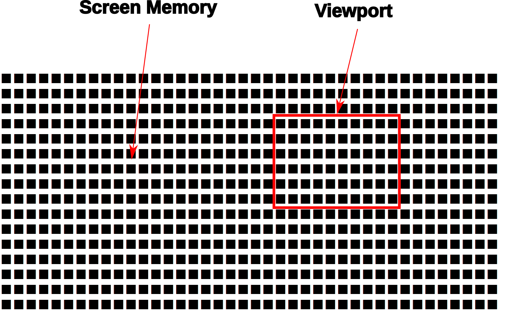

As in the horizontal scrolling examples above, the combined scrolling examples
will also use the page-per-line memory layout: 256 bytes per line.

Horizontal coarse scrolling requires an ``LMS`` address for every display list
line in the scrolling region, and using this memory layout means that the low
byte of that address is modified for every scroll. The high byte is unmodified.

Vertical coarse scrolling using this display list and memory layout is
convenient because the vertical position of the viewport is solely dependent on
the high byte of the memory address; the low byte is unchanged.

This memory layout simplifies combined scrolling because it decouples the
vertical position and horizontal position! Combined scrolling is then reduced
to changing the high byte of each ``LMS`` address to reflect the vertical
location of the viewport, and changing the low byte to set the horizontal
location.

Example: 2D Coarse Scrolling
-----------------------------------------------------

This example scrolls the viewport simultaneously in the vertical and horizontal
directions using the techniques described above.

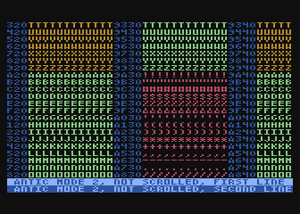

.. raw:: html

   <ul>
   <li><b>Source Code:</b> <a href="https://raw.githubusercontent.com/playermissile/scrolling_tutorial/master/src/coarse_scroll_2d.s">coarse_scroll_2d.s</a></li>
   <li><b>Executable:</b> <a href="https://raw.githubusercontent.com/playermissile/scrolling_tutorial/master/xex/coarse_scroll_2d.xex">coarse_scroll_2d.xex</a></li>
   </ul>

The display list is unchanged from the horizontal coarse scrolling examples.

There are several differences in code from the horizontal scrolling version.
First some variables are added to track the direction at which the viewport is
moving (and they are initialized):

.. code-block::

   horz_dir = $80  ; 1 = right, $ff = left
   vert_dir = $81  ; 1 = down, $ff = up

           lda #$ff
           sta horz_dir
           lda #1
           sta vert_dir

We will need to track where the viewport is on screen, and instead of creating
extra variables for it, we can realize that the display list itself will tell
us where the viewport is. Choosing the reference point to be the upper left
corder of the viewport window means that the very first ``LMS`` instruction in
the display list is exactly our reference point. The low byte of the ``LMS``
address is the horizontal position and the high byte is the vertical.

.. code-block::

    ; representative values for vertical and horizontal scrolling: the pointers
    ; to the display list LMS addresses themselves
    horz_ref = dlist_lms_mode4 + 4
    vert_ref = dlist_lms_mode4 + 5

The code that moves the viewport horizontally checks the horizontal direction
before determining how to changing the low bytes of the ``LMS`` addresses:

.. code-block::

   ; move viewport one byte to the left/right by pointing each display list
   ; address to one lower/byte higher in memory (i.e. changing low byte)
   coarse_scroll_horz
           ldy #22         ; 22 lines to modify
           ldx #0
           lda horz_dir
           bmi ?left
   ?right  inc horz_ref,x  ; low bytes of display list referenced at this addr
           inx             ; skip to next low byte which is 3 bytes away
           inx
           inx
           dey
           bne ?right
           rts
   
   ?left   dec horz_ref,x  ; low bytes of display list referenced at this addr
           inx             ; skip to next low byte which is 3 bytes away
           inx
           inx
           dey
           bne ?left
           rts

Vertical scrolling changes the high bytes of the ``LMS`` addresses lines. The
code is very similar to the above:

.. code-block::

   ; move viewport one line up/down by pointing each display list address
   ; one *page* lower/byte higher in memory (i.e. changing high byte)
   coarse_scroll_vert
           ldy #22         ; 22 lines to modify
           ldx #0
           lda vert_dir
           bmi ?up
   ?down   inc vert_ref,x  ; high bytes of display list referenced at this addr
           inx             ; skip to next high byte which is 3 bytes away
           inx
           inx
           dey
           bne ?down
           rts
   
   ?up     dec vert_ref,x  ; high bytes of display list referenced at this addr
           inx             ; skip to next high byte which is 3 bytes away
           inx
           inx
           dey
           bne ?up
           rts

Some boundary checking is added referencing some constants describing the
limits of the memory layout, and the viewport bounces off the sides as if it
were a pong game.

.. code-block::

   horz_min = 0    ; horizontal lower bound
   horz_max = 255-44 ; horizontal upper bound is page width, less some extra to prevent unintentional wraparound
   vert_min = $80  ; page $80 is first line in memory region
   vert_max = $80+52-22 ; 52 lines high and 22 visible at a time

           ; check if horizontal direction needs updating
           lda horz_ref    ; reference horizontal position
           cmp #horz_max   ; too far to the right?
           bcc ?ck_left
           lda #$ff        ; yep, start scrolling left
           sta horz_dir
           bne ?ck_down
   ?ck_left cmp #horz_min  ; at left boundary?
           bne ?ck_down
           lda #1          ; yep, start scrolling right
           sta horz_dir
   
           ; check if vertical direction needs updating
   ?ck_down lda vert_ref   ; reference vertical position
           cmp #vert_max   ; too far to down?
           bcc ?ck_up
           lda #$ff        ; yep, start scrolling up
           sta vert_dir
           bne ?scroll
   ?ck_up cmp #vert_min+1  ; at top boundary?
           bcs ?scroll
           lda #1          ; yep, start scrolling down
           sta vert_dir

Vertical Fine Scrolling
-----------------------------------------------

Vertical fine scrolling is controlled by ANTIC's ``VSCROL`` hardware register.
The register can be any number from 0 - 15 representing the number of scan
lines to scroll. ANTIC accomplishes scrolling not by moving the display list up
and down by a number of scan lines, but by using the ``VSCROL`` value to *skip*
that number of scan lines in the first line of the display list, essentially
shortening the number of displayed lines.

This will become more clear with an example. First, let's see what happens just
by turning on the vertical scrolling bit on a display list.

Preparing the Display List
~~~~~~~~~~~~~~~~~~~~~~~~~~~~~~~~~~~~~~~

Here's the same program used in the :ref:`coarse vertical scrolling
<coarse_no_scroll_dlist>` section, except now the vertical scrolling bit has
been set on the display list instructions for the scrolling region of lines A
through V. Notice the first line of the mode 2 status lines at he bottom seems
to be missing! Actually, it is still there, or more correctly: one scan line of
it is still there.

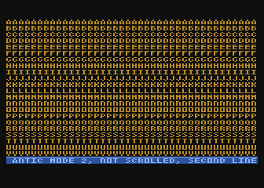

.. raw:: html

   <ul>
   <li><b>Source Code:</b> <a href="https://raw.githubusercontent.com/playermissile/scrolling_tutorial/master/src/fine_vscroll_dlist.s">fine_vscroll_dlist.s</a></li>
   <li><b>Executable:</b> <a href="https://raw.githubusercontent.com/playermissile/scrolling_tutorial/master/xex/fine_vscroll_dlist.xex">fine_vscroll_dlist.xex</a></li>
   </ul>

Note that the ``VSCROL`` hardware register is set to zero. Here's the display list:

.. code-block::

   ; Simple display list to be used as coarse scrolling comparison
   dlist_coarse_mode4
           .byte $70,$70,$70       ; 24 blank lines
           .byte $44,$00,$80       ; Mode 4 + LMS + address
           .byte $64,$00,$80       ; Mode 4 + VSCROLL + LMS + address
           .byte $24,$24,$24,$24,$24,$24,$24,$24   ; 21 more Mode 4 + VSCROLL lines
           .byte $24,$24,$24,$24,$24,$24,$24,$24
           .byte $24,$24,$24,$24,$24
           .byte $42,<static_text, >static_text ; 2 Mode 2 lines + LMS + address
           .byte $2
           .byte $41,<dlist_coarse_mode4,>dlist_coarse_mode4 ; JVB ends display list

So what is the mystery of the (mostly) missing mode 2 line at the bottom? ANTIC
uses the first scan line that doesn't have the vertical scrolling bit set as a
sort-of *buffer zone* to the scrolling region.

Here's the same example, except the ``VSCROL`` register is set to 4:

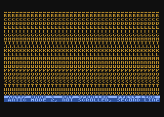

where it shows that 4 scan lines of line A have been scrolled off the screen
**and** the first ANTIC mode 2 line shows 4 of its 8 scan lines.

.. _vscroll:

The VSCROL Hardware Register
------------------------------------

The ``VSCROL`` hardware register at ``$d405`` controls how many scan lines are
shifted for fine scrolling. The value tells ANTIC on which scan line to start
rendering for the first display list instruction it encounters with the
vertical scrolling bit set. Subsequent lines in the display list that have the
vertical scrolling bit set are fully rendered, but because that initial scan
line was rendered with fewer scan lines, the display has appeared to move up.

What confused the author until reading section 4.7 in the `Altirra Hardware Reference Manual <http://www.virtualdub.org/downloads/Altirra%20Hardware%20Reference%20Manual.pdf>`_
is that ``VSCROL`` value also controls where ANTIC *stops* rendering on that
*buffer zone* display list instruction: it renders scan lines up to and
including that value.

In the first example, ``VSCROL = 0``. ANTIC mode 4 lines are 8 scan lines tall,
and for scrolling purposes the height of a mode line is enumerated from 0, so
an 8 scan line tall text mode has scan lines numbered 0 through 7. For the
example, the rendering of line A starts at scan line zero of the text mode. The
buffer zone mode 2 line that is only rendered with a single scan line: it
stopped rendering after rendering scan line zero of that mode 2 line.

The second example uses ``VSCROL`` set to 4, here shown in detail:

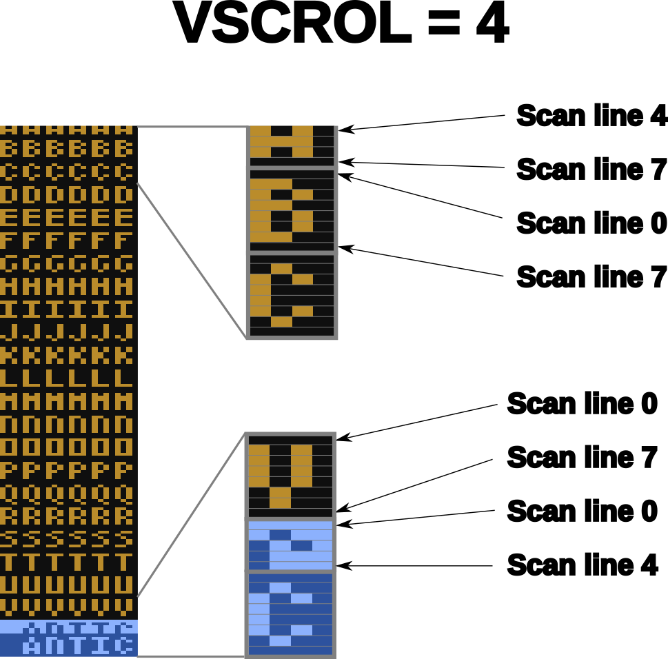

The first display list line with the vertical scrolling bit set, Line A, is
rendered starting from scan line 4 (again, as enumerated from zero: scan lines
0, 1, 2, and 3 are skipped and 4, 5, 6, and 7 are rendered). All subsequent
lines with their vertical scroll bit set have all 8 scan lines rendered. The
buffer zone, that is: the first display list line without the scroll bit set,
is rendered *through* scan line 4 as enumerated from zero, so scan lines 0, 1,
2, 3, and 4. Scan lines 5 through 7 are not rendered.

.. seealso::

   * Section 4.7 in the `Altirra Hardware Reference Manual <http://www.virtualdub.org/downloads/Altirra%20Hardware%20Reference%20Manual.pdf>`_
   * `De Re Atari, Chapter 2 <https://www.atariarchives.org/dere/chapt02.php>`_

.. _fixed_vscroll:

Fixing the Last Scrolled Line
~~~~~~~~~~~~~~~~~~~~~~~~~~~~~~~~~~~~

Having the scrolled region extend into the status lines at the bottom of the
previous example is obviously not what's intended. This example fixes that
problem:

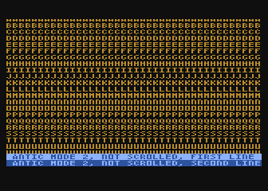

.. raw:: html

   <ul>
   <li><b>Source Code:</b> <a href="https://raw.githubusercontent.com/playermissile/scrolling_tutorial/master/src/fine_vscroll_better_dlist.s">fine_vscroll_better_dlist.s</a></li>
   <li><b>Executable:</b> <a href="https://raw.githubusercontent.com/playermissile/scrolling_tutorial/master/xex/fine_vscroll_better_dlist.xex">fine_vscroll_better_dlist.xex</a></li>
   </ul>

The solution is to clear the vertical scrolling bit on the final mode 4 line in
the scrolling region. Here's the new display list with only a single byte
changed: the final ``$24`` in the previous example is changed to a normal mode
4 line:

.. code-block::

   ; Simple display list to be used as coarse scrolling comparison
   dlist_coarse_mode4
           .byte $70,$70,$70       ; 24 blank lines
           .byte $44,$00,$80       ; Mode 4 + LMS + address
           .byte $64,$00,$80       ; Mode 4 + VSCROLL + LMS + address
           .byte $24,$24,$24,$24,$24,$24,$24,$24   ; 20 more Mode 4 + VSCROLL lines
           .byte $24,$24,$24,$24,$24,$24,$24,$24
           .byte $24,$24,$24,$24
           .byte 4                 ; and the final Mode 4 without VSCROLL
           .byte $42,<static_text, >static_text ; 2 Mode 2 lines + LMS + address
           .byte $2
           .byte $41,<dlist_coarse_mode4,>dlist_coarse_mode4 ; JVB ends display list

This leaves the status lines with two complete mode 2 lines, and the scrolling
playfield as 21 mode 4 lines, and a one line *buffer zone*, this time of mode
4. In this case, ``VSCROL = 4``, so the first scrolled line is rendered
starting at its scan line 4 and the buffer zone line is rendered through its
scan line 4, we are missing 7 scan lines from the same display list without any
vertical scrolling bits.

.. note:: The number of scan lines ANTIC will generate is reduced by vertical scrolling. The total number of scan lines can be counted by setting ``VSCROL = 0``, meaning the buffer zone line will be reduced to a single scan line. Changes to ``VSCROL`` don't change the total number of lines generated, for instance: setting ``VSCROL = 2`` reduces the first scrolled line to 6 scan lines but increases the buffer zone to 3 scan lines, resulting in the same net number of scan lines in the scrolling + buffer zone regions.

.. _vscroll_down:

Example: Fine Scrolling Down
-------------------------------

We can now add the ``VSCROL`` hardware register to the coarse scrolling demo to
produce fine scrolling:

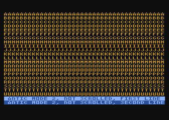

.. raw:: html

   <ul>
   <li><b>Source Code:</b> <a href="https://raw.githubusercontent.com/playermissile/scrolling_tutorial/master/src/fine_scroll_down.s">fine_scroll_down.s</a></li>
   <li><b>Executable:</b> <a href="https://raw.githubusercontent.com/playermissile/scrolling_tutorial/master/xex/fine_scroll_down.xex">fine_scroll_down.xex</a></li>
   </ul>

The code for this example is largely the same as the :ref:`coarse scroll down
<coarse_scroll_down>` demo, which a few minor additions. We need one
additional variable to keep our own copy of the hardware scrolling register,
since ``VSCROL`` is a write-only register:

.. code-block::

   vert_scroll = $90       ; variable used to store VSCROL value
   vert_scroll_max = 8     ; ANTIC mode 4 has 8 scan lines

The ``init`` code from the demo also needs to initialize the variable:

.. code-block::

           lda #0          ; initialize vertical scrolling value
           sta vert_scroll
           sta VSCROL      ; initialize hardware register

and the main loop calls the fine scrolling routine instead of the coarse
scrolling routine.

.. code-block::

   loop    ldx #delay      ; number of VBLANKs to wait
   ?start  lda RTCLOK+2    ; check fastest moving RTCLOCK byte
   ?wait   cmp RTCLOK+2    ; VBLANK will update this
           beq ?wait       ; delay until VBLANK changes it
           dex             ; delay for a number of VBLANKs
           bpl ?start
   
           ; enough time has passed, scroll one scan line
           jsr fine_scroll_down
   
           jmp loop

The ``fine_scroll_down`` routine takes care of updating the fine scrolling
variable and setting the hardware ``VSCROL`` register. If it has scrolled 8
scan lines, it calls the ``coarse_scroll_down`` routine, which is unchanged
from the coarse scrolling demo.

.. code-block::

   ; scroll one scan line down and check if at VSCROL limit
   fine_scroll_down
           inc vert_scroll
           lda vert_scroll
           cmp #vert_scroll_max ; check to see if we need to do a coarse scroll
           bcc ?done       ; nope, still in the middle of the character
           jsr coarse_scroll_down ; yep, do a coarse scroll...
           lda #0          ;  ...followed by reseting the vscroll register
           sta vert_scroll
   ?done   sta VSCROL      ; store vertical scroll value in hardware register
           rts

.. _vscroll_up:

Example: Fine Scrolling Up
----------------------------

The code for fine scrolling the viewport up has very few changes from the above.

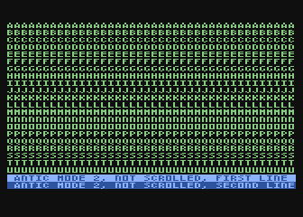

.. raw:: html

   <ul>
   <li><b>Source Code:</b> <a href="https://raw.githubusercontent.com/playermissile/scrolling_tutorial/master/src/fine_scroll_up.s">fine_scroll_up.s</a></li>
   <li><b>Executable:</b> <a href="https://raw.githubusercontent.com/playermissile/scrolling_tutorial/master/xex/fine_scroll_up.xex">fine_scroll_up.xex</a></li>
   </ul>

The delay loop is the same, just calling the subroutine to do a fine scroll up
instead of down. The logic does change a little bit, as we are now decrementing
the ``vert_scroll`` variable. Since zero is a valid value for the ``VSCROL``
hardware register, we check to see when the decrement wraps back to ``$ff`` to
determine if a coarse scroll needs to happen:

.. code-block::

   ; scroll one scan line up and check if at VSCROL limit
   fine_scroll_up
           dec vert_scroll
           lda vert_scroll
           bpl ?done       ; if non-negative, still in the middle of the character
           jsr coarse_scroll_up   ; wrapped to $ff, do a coarse scroll...
           lda #vert_scroll_max-1 ;  ...followed by reseting the vscroll register
           sta vert_scroll
   ?done   sta VSCROL      ; store vertical scroll value in hardware register
           rts

The only other change is pointing the initial display list ``LMS`` address to a
line further down in the memory layout so there is scrolling room as the
viewport moves up.

Interlude: Wide and Narrow Playfields
-----------------------------------------------------

Normal display lists for mode 4 are 40 bytes wide, producing 40 characters.
This is equivalent to 160 color clocks, the standard playfield width. ANTIC is
capable of drawing two other widths, however: a narrow playfield of 128 color
clocks (32 bytes) and a wide playfield of 176 color clocks (48 bytes). This is
controlled by two of the bits of the hardware register ``DMACTL`` at ``$d400``
and its shadow ``SDMCTL`` at ``$22f``.

Horizontal Fine Scrolling
------------------------------------------------------

Horizontal fine scrolling is controlled by ANTIC's ``HSCROL`` hardware
register. The register can be any number from 0 - 15 representing the number of
color clocks to scroll. ANTIC accomplishes horizontal scrolling by, behind the
scenes, reading data as if the playfield width was the next larger size, but
continuing to display the screen with the nominal playfield width.

For example, if ANTIC is scrolling the normal 40 byte playfield, it will
process data as if it were displaying the wide playfield of 48 bytes per line.
It will, however, only *display* 40 bytes worth of data: 160 color clocks.

This will become more clear with an example. First, let's see what happens just
by turning on the horizontal scrolling bit on a display list.

Preparing the Display List
~~~~~~~~~~~~~~~~~~~~~~~~~~~~~~~~~~~~~~~

This simple program shows the memory layout defined in the :ref:`coarse
scrolling <coarse_scroll_left>` section, where lines are 256 bytes wide and
every 16 bytes it is stamped with the address of that byte as a 4 digit hex
value. For example, the left-most byte of the top line of the screen is at
memory location ``$8070``, so the memory layout is formatted to show the high
nibble (the ``8`` from ``8070``) directly on the address to be labeled, and the
next 3 nibbles converted to digits displayed in the 3 subsequent columns.

.. raw:: html

   <ul>
   <li><b>Source Code:</b> <a href="https://raw.githubusercontent.com/playermissile/scrolling_tutorial/master/src/memory_layout_hscroll.s">memory_layout_hscroll.s</a></li>
   <li><b>Executable:</b> <a href="https://raw.githubusercontent.com/playermissile/scrolling_tutorial/master/xex/memory_layout_hscroll.xex">memory_layout_hscroll.xex</a></li>
   </ul>

The display list used here does *not* have any scrolling bits set, it's exactly
the same as a coarse scrolling display list with a ``LMS`` instruction on each
of the lines A through L. All of the ``LMS`` addresses have their low bytes set
to ``$70``, where the line at the top of the screen is set to ``$8070`` with
the following display list instruction:

.. code-block::

           .byte $44,$70,$80

Below is almost the same program, the only difference being the horizontal
scrolling bit has been set on the display list instructions for the scrolling
region of lines A through V, so for example the first mode 4 line has both the
``LMS`` and ``HSCROLL`` bits set:

.. code-block::

           .byte $54,$70,$80

Notice the low byte of the display list ``LMS`` addresses remain set at ``$70``, so the the upper left corner of the screen address is supposed to start at ``$8070``, but the resulting visible region looks like this:

.. raw:: html

   <ul>
   <li><b>Source Code:</b> <a href="https://raw.githubusercontent.com/playermissile/scrolling_tutorial/master/src/fine_hscroll_dlist.s">fine_hscroll_dlist.s</a></li>
   <li><b>Executable:</b> <a href="https://raw.githubusercontent.com/playermissile/scrolling_tutorial/master/xex/fine_hscroll_dlist.xex">fine_hscroll_dlist.xex</a></li>
   </ul>

The first visible byte in the upper left corner of starts at ``$8074``!

This is a consequence of the wide playfield being used behind the scenes as a
buffer for the extra data needed for the color clock shift.

The HSCROL Hardware Register
------------------------------------

The ``HSCROL`` hardware register at ``$d404`` controls the horizontal shift for
fine scrolling, measured in color clocks from 0 - 15.

On display list instructions with the horizontal scrolling bit set, ANTIC
automatically expands its screen memory use to the next larger playfield size,
unless it is already using a wide playfield. Scrolling with a 32 byte narrow
playfield will cause ANTIC to read memory as if it were using a normal 40 byte
playfield, and scrolling a normal playfield will be processed as if it were a
wide 48 byte playfield.

It uses these extra bytes as the scrolling *buffer zone*, the horizontal
equivalent of the vertical :ref:`buffer zone <vscroll>` that takes scan lines
from the first display list instruction with the vertical scroll bit cleared
after a scrolling section.

Each playfield expansion results in 8 extra bytes of data being read. They are
distributed with 4 bytes to the left of the playfield and 4 bytes to the right.
Notice that 4 bytes corresponds to 16 color clocks, exactly the limit of the
``HSCROL`` register.

The ``HSCROL`` value is the number of color clocks in this buffer zone that are
shifted into the main view. The *size* of the display does not change, so for
instance in a scrolled, normal playfield, the equivalent of 40 bytes worth of
color clocks, 160, are still displayed, centered as normal in the TV display.
But where those color clocks *start* is what's controlled by ``HSCROL``.

For example, here's the previous example except with the ``HSCROL`` value set to 6:

.. figure:: fine_hscroll_6.png
   :align: center
   :width: 90%

.. raw:: html

   <ul>
   <li><b>Source Code:</b> <a href="https://raw.githubusercontent.com/playermissile/scrolling_tutorial/master/src/fine_hscroll_6.s">fine_hscroll_6.s</a></li>
   <li><b>Executable:</b> <a href="https://raw.githubusercontent.com/playermissile/scrolling_tutorial/master/xex/fine_hscroll_6.xex">fine_hscroll_6.xex</a></li>
   </ul>

The value of ``HSCROL`` is the number of color clocks to scroll the viewport to
the left. Equivalently, you can think of it as the number of color clocks in
the left side buffer zone that are shifted to the right into the visible area.

.. seealso::

   * Section 4.7 in the `Altirra Hardware Reference Manual <http://www.virtualdub.org/downloads/Altirra%20Hardware%20Reference%20Manual.pdf>`_
   * `De Re Atari, Chapter 2 <https://www.atariarchives.org/dere/chapt02.php>`_

Example: Fine Scrolling Left
-------------------------------

We can now add the ``HSCROL`` hardware register to the coarse scrolling demo to
produce fine scrolling:

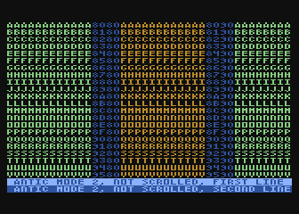

.. raw:: html

   <ul>
   <li><b>Source Code:</b> <a href="https://raw.githubusercontent.com/playermissile/scrolling_tutorial/master/src/fine_scroll_left.s">fine_scroll_left.s</a></li>
   <li><b>Executable:</b> <a href="https://raw.githubusercontent.com/playermissile/scrolling_tutorial/master/xex/fine_scroll_left.xex">fine_scroll_left.xex</a></li>
   </ul>

The code for this example is largely the same as the :ref:`coarse scroll down
<coarse_scroll_left>` demo, and like the vertical fine scrolling examples we
need one additional variable to keep our own copy of the hardware scrolling
register, since ``HSCROL`` is a write-only register:

.. code-block::

   horz_scroll = $91       ; variable used to store HSCROL value
   horz_scroll_max = 4     ; ANTIC mode 4 has 4 color clocks

The ``init`` code from the demo also needs to initialize the variable:

.. code-block::

           lda #0          ; initialize horizontal scrolling value
           sta horz_scroll
           sta HSCROL      ; initialize hardware register

and the main loop calls the fine scrolling routine instead of the coarse
scrolling routine.

.. code-block::

   loop    ldx #15         ; number of VBLANKs to wait
   ?start  lda RTCLOK+2    ; check fastest moving RTCLOCK byte
   ?wait   cmp RTCLOK+2    ; VBLANK will update this
           beq ?wait       ; delay until VBLANK changes it
           dex             ; delay for a number of VBLANKs
           bpl ?start
   
           ; enough time has passed, scroll one color clock
           jsr fine_scroll_left
   
           jmp loop

The ``fine_scroll_left`` routine update the fine scrolling variable and setting
the hardware ``HSCROL`` register. If it has scrolled 4 color clocks, it calls
the ``coarse_scroll_left`` routine, which is unchanged from the coarse
scrolling demo.

.. code-block::

   ; scroll one color clock left and check if at HSCROL limit
   fine_scroll_left
           inc horz_scroll
           lda horz_scroll
           cmp #horz_scroll_max ; check to see if we need to do a coarse scroll
           bcc ?done       ; nope, still in the middle of the character
           jsr coarse_scroll_left ; yep, do a coarse scroll...
           lda #0          ;  ...followed by reseting the HSCROL register
           sta horz_scroll
   ?done   sta HSCROL      ; store vertical scroll value in hardware register
           rts

But notice the difference between vertical scrolling and horizontal scrolling:
For horizontal scrolling, *incrementing* the HSCROL value performs fine
scrolling of the viewport to the left, but the coarse scrolling requires
*decrementing* the ``LMS`` addresses.

.. code-block::

   ; move viewport one byte to the left by pointing each display list start
   ; address to one byte lower in memory
   coarse_scroll_left
           ldy #22         ; 22 lines to modify
           ldx #4          ; 4th byte after start of display list is low byte of address
   ?loop   dec dlist_hscroll_mode4,x
           inx             ; skip to next low byte which is 3 bytes away
           inx
           inx
           dey
           bne ?loop
           rts

Example: Fine Scrolling Right
---------------------------------------

The code for fine scrolling the viewport to the right has only minor
differences from the above.

.. raw:: html

   <ul>
   <li><b>Source Code:</b> <a href="https://raw.githubusercontent.com/playermissile/scrolling_tutorial/master/src/fine_scroll_right.s">fine_scroll_right.s</a></li>
   <li><b>Executable:</b> <a href="https://raw.githubusercontent.com/playermissile/scrolling_tutorial/master/xex/fine_scroll_right.xex">fine_scroll_right.xex</a></li>
   </ul>

The changes in the code are: the variable ``vert_scroll`` is decremented in the
fine scrolling subroutine, and the ``LMS`` addresses in the coarse scrolling
subroutine is incremented.

Example: Fine Scrolling with Wide Playfield
-----------------------------------------------

Since ANTIC expands the playfield to the next larger size when reading data for
the scrolling region, there's no real additional cost to also displaying the
wider playfield. ANTIC is stealing the cycles as if it were the larger
playfield anyway, we might as well see it:

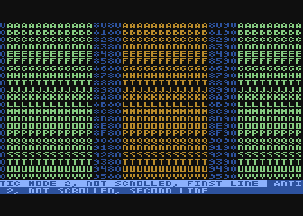

.. raw:: html

   <ul>
   <li><b>Source Code:</b> <a href="https://raw.githubusercontent.com/playermissile/scrolling_tutorial/master/src/fine_scroll_right_wide.s">fine_scroll_right_wide.s</a></li>
   <li><b>Executable:</b> <a href="https://raw.githubusercontent.com/playermissile/scrolling_tutorial/master/xex/fine_scroll_right_wide.xex">fine_scroll_right_wide.xex</a></li>
   </ul>

The only change to the example above is setting the DMA control variable:

.. code-block::
   
           lda #$23        ; enable wide playfield
           sta SDMCTL      ;   by saving to shadow register

which sets the wide playfield bits forcing the display of the 48 byte wide
playfield. But notice how the non-scrolling status area is now also 48 bytes
wide, changing the text to wrap 8 bytes from the 2nd line onto the first.

Interlude: Display List Interrupts
------------------------------------------------

Display list interrupts (DLIs) provide a notification to your program when
ANTIC is about to process a particular scan line. By setting a bit on a display
list instruction, ANTIC will interrupt the normal CPU processing and send
control through a special vector that you can use to perform an actions at the
location on screen corresponding to the last scan line generated by that
display list instruction. See my :ref:`complete(ish) tutorial<dli_tutorial>`
for lots more information.

.. _wide_dli:

Example: Wide Scrolling Playfield with Normal Status Lines
----------------------------------------------------------------

Using a simple DLI we can force the status lines back to their normal 40 byte
width. This is a freeze-frame image showing the scrolling playfield using the
wide, 48 byte playfield and the status lines back to the normal width:

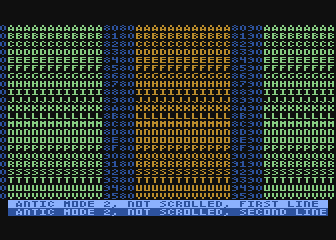

.. raw:: html

   <ul>
   <li><b>Source Code:</b> <a href="https://raw.githubusercontent.com/playermissile/scrolling_tutorial/master/src/fine_scroll_right_wide_dli.s">fine_scroll_right_wide_dli.s</a></li>
   <li><b>Executable:</b> <a href="https://raw.githubusercontent.com/playermissile/scrolling_tutorial/master/xex/fine_scroll_right_wide_dli.xex">fine_scroll_right_wide_dli.xex</a></li>
   </ul>

The DLI bit must be set on the display list instruction immediately before the
status line:

.. code-block::
   
           .byte $d4,$70,$95       ; last line in scrolling region: HSCROLL + DLI

the DLI vector must be set to our routine and activated:

.. code-block::

           ; load display list interrupt address
           lda #<dli
           sta VDSLST
           lda #>dli
           sta VDSLST+1
   
           ; activate display list interrupt
           lda #NMIEN_VBI | NMIEN_DLI
           sta NMIEN

and finally the DLI routine itself

.. code-block::
   
   dli     pha             ; only using A register, so save old value to the stack
           lda #$22        ; normal playfield width
           sta WSYNC       ; any value saved to WSYNC will trigger the pause
           sta DMACTL      ; store it in the hardware register
           pla             ; restore the A register
           rti             ; always end DLI with RTI!

which sets the normal playfield width using the hardware register, which takes
effect immediately. Recall that changes to the hardware registers produce
immediate effect, while the shadow registers are restored at the vertical blank
by the operating system. Therefore we do not have to restore the playfield
width ourselves thanks to our use of the shadow register. The operating system
will return the scrolling portion of the playfield back to 48 bytes wide.

Interlude: Vertical Blank Interrupts
------------------------------------------------

In the previous examples, the technique for updating ``LMS`` addresses and
changing hardware scrolling registers has been waiting until the the vertical
blank has passed, then performing the changes.

This will quickly become insufficient as we move to horizontal scrolling, and
further into more real-world examples. Looping until the value of ``RTCLOK+2``
changes doesn't mean the vertical blank has *just* passed; rather, it means
that all of the vertical blank code has executed and performed its ``RTI``. The
vertical blank may take many thousands of CPU cycles, and may not return until
well into the visible part of the screen.

In simple demos and toy examples, the ``RTCLOK+2`` technique *is* largely
sufficient. But there are scenarios where problems can arise if updates to the hardware register happen at specific times.

For instance, in an `AtariAge forum post
<https://atariage.com/forums/topic/299468-wip-scrolling-tutorial/>`_, the
author of the Altirra emulator stated: "failing to synchronize [register
changes] to the drawing can not only cause delays, it can seriously glitch the
display list. Specifically, decreasing VSCROL around when ANTIC is processing
the end of the vertical scrolling region can cause it to miss the vertical stop
and wrap its 4-bit delta counter around, adding a dozen scanlines to the mode
line."

Other unexpected effects like screen tearing could occur if changes happen to
the hardware registers while ANTIC is drawing the scrolling region. There are
cases, for instance :ref:`parallax scrolling <parallax_scrolling>` and
multiple independent scrolling regions where it is desired that the registers
be changed mid-screen, but these will be performed in a DLI where the change
can occur on a particular scanline and during the horizontal blank.

For all these reasons, and as the examples are becoming more complicated and
applicable to real applications, the code to update the scrolling registers and
``LMS`` addresses will be moved into the vertical blank to avoid any potential
mid-screen changes.

Combined Fine Scrolling
--------------------------------------------------

Notice the difference between vertical scrolling and horizontal scrolling: For
horizontal scrolling, *incrementing* the ``HSCROL`` value performs fine
scrolling of the viewport to the left, but the coarse scrolling left requires
*decrementing* the ``LMS`` addresses.

In vertical scrolling, *incrementing* the ``VSCROL`` value performs fine
scrolling of the viewport down, and the coarse scrolling down also requires
*incrementing* the ``LMS`` addresses.

So, horizontal scrolling has the hardware register and the ``LMS`` addresses
requiring opposite mathematical operations, while vertical scrolling sees the
hardware register and LMS addresses changing in the same direction.

Another issue to be aware of is the difference in size of the "scrolling
units". Horizontal scrolling uses color clocks, while vertical scrolling uses
scan lines. There are 160 color clocks in a normal width playfield. ANTIC mode
4 characters are 4 color clocks wide, and there are 40 characters per line.

ANTIC mode 4 characters are 8 scan lines tall, and on the TV screen the
characters are roughly square. (They're not exacly square; see the Altirra
Hardware Reference Manual, Section 4.2, for more information.) If a program
scrolls one unit horizontally and one unit vertically, the image will appear to
move about twice as much horizontally as vertically. To move with a more "true"
diagonal appearance would require a ratio of one unit horizontally and two
vertically.

Preparing the Display List
~~~~~~~~~~~~~~~~~~~~~~~~~~~~~~~~~~~~~~~

Scrolling both horizontally and vertically requires the memory layout described
in the :ref:`combined coarse scrolling section <combined_memory_layout>`, lines
wider than the visible playfield and more lines than the visible playfield is
tall. Notice, as in the :ref:`vertical <fixed_vscroll>` :ref:`fine
<vscroll_down>` :ref:`scrolling <vscroll_up>` examples, line **V** (the last
line in the scrolling region) has been reduced to a single scan line:

.. figure:: fine_scroll_2d_dlist.png
   :align: center
   :width: 90%

.. raw:: html

   <ul>
   <li><b>Source Code:</b> <a href="https://raw.githubusercontent.com/playermissile/scrolling_tutorial/master/src/fine_scroll_2d_dlist.s">fine_scroll_2d_dlist.s</a></li>
   <li><b>Executable:</b> <a href="https://raw.githubusercontent.com/playermissile/scrolling_tutorial/master/xex/fine_scroll_2d_dlist.xex">fine_scroll_2d_dlist.xex</a></li>
   </ul>

For fine scrolling, the display list requires the ``HSCROLL`` bit for all
scrolled lines, and as :ref:`described above <fixed_vscroll>`, the ``VSCROLL``
bit set on all but the last line of the scrolled region. So, all the display
list instructions in the scrolling region except the last line look like this:

.. code-block::
   
        .byte $74,$70,$80       ; ANTIC mode 4 + VSCROLL + HSCROLL

and the last line in the scrolling region doesn't set the ``VSCROLL`` bit:

.. code-block::
   
        .byte $54,$70,$95       ; last line in scrolling region, HSCROLL only

Example: Wide vs Narrow -- 2D Scrolling with DLI
--------------------------------------------------------------

In the :ref:`example with the DLI<wide_dli>` for the wide scrolling playfield
and narrow status, the DLI occurred on the last scan line of the last ANTIC
mode 4 line in the scrolling playfield, leaving plenty of time for the DLI to
change the ``DMACTL`` register before ANTIC started drawing the first line of
the status area.

However, trying to use the same DLI on the same display list instruction (line
**V**) creates a problem when adding vertical scrolling to the playfield: that
bit is cleared on the display list instruction for last line of the scrolling
region, reducing it to a single scan line when the hardware register ``VSCROL =
0``. However, almost no CPU cycles are available on the first scan line of
ANTIC mode 4, as ANTIC steals so many to prepare the font glyphs:

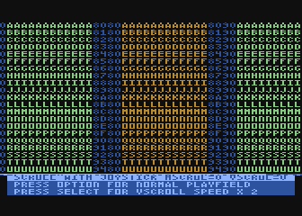

Notice that it doesn't happen when the screen is scrolled to any scan line
other than the first scan line, so whenever ``VSCROL > 0`` it works fine.
Recall as described in the :ref:`VSCROLL Hardware Register <vscroll>` section
above, ``VSCROL`` controls the start & stop scan lines of the first display
list instruction *after* the vertical scrolling bit is cleared. ``VSCROL = 0``
produces one scan line, which in turn produces the DLI problem shown above.
``VSCROL = 1`` produces *two* scan lines, giving the DLI time to complete while
still processing the 2nd scan line, before reaching the status text area:

The problem is not present when the scrolled area is set to normal width
regardless of the value of ``VSCROL``, despite the DLI still happening on the
first scan line of a mode 4 line. It turns out there are enough cycles
available on the first line of a normal playfield (ANTIC steals 8 fewer cycles,
and as it happens that that's *just* enough for the code in this simple DLI):

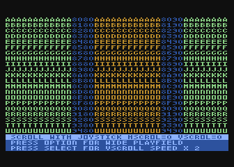

.. raw:: html

   <ul>
   <li><b>Source Code:</b> <a href="https://raw.githubusercontent.com/playermissile/scrolling_tutorial/master/src/fine_scroll_2d_joystick.s">fine_scroll_2d_joystick.s</a></li>
   <li><b>Executable:</b> <a href="https://raw.githubusercontent.com/playermissile/scrolling_tutorial/master/xex/fine_scroll_2d_joystick.xex">fine_scroll_2d_joystick.xex</a></li>
   </ul>

Further Ideas
-------------------------------

I'm planning on writing a fine scrolling game engine that will take the ideas
presented here and apply it to real world problem, or a real world problem
circa 1984.

My goals are omni-directional 2D scrolling, so not just 8-way scrolling but at
any angle with a fixed-point integer math that will keep track of fractional
parts of ``HSCROL`` and ``VSCROL``. At this point, I'm not sure about making
the wraparound world like Mountain King or a world with limits like Nautilus.

But, when written, the fine scrolling engine will be large, so I'm moving it to
a separate tutorial: :ref:`Atari 8-bit Fine Scrolling Game Engine
<scrolling_engine>`
